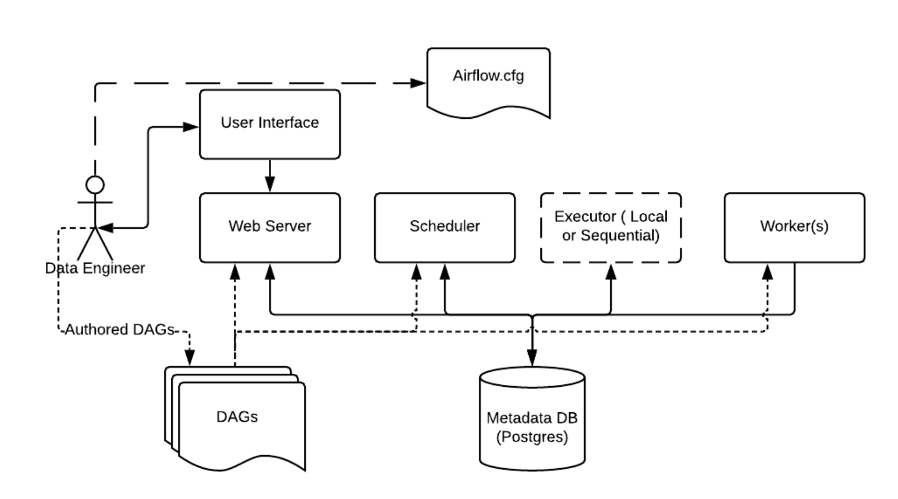
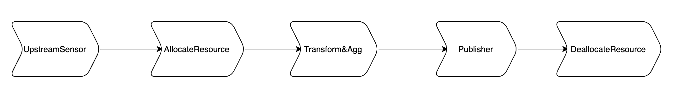
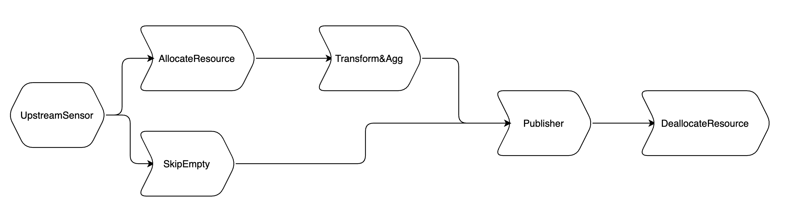
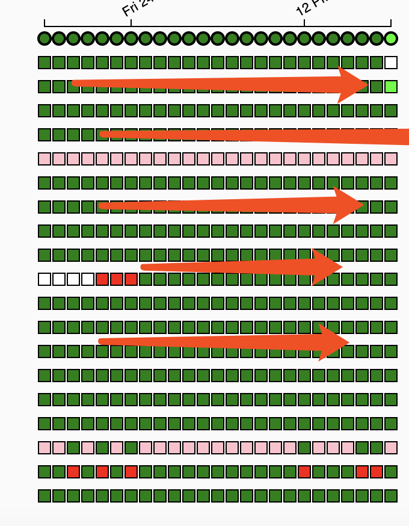
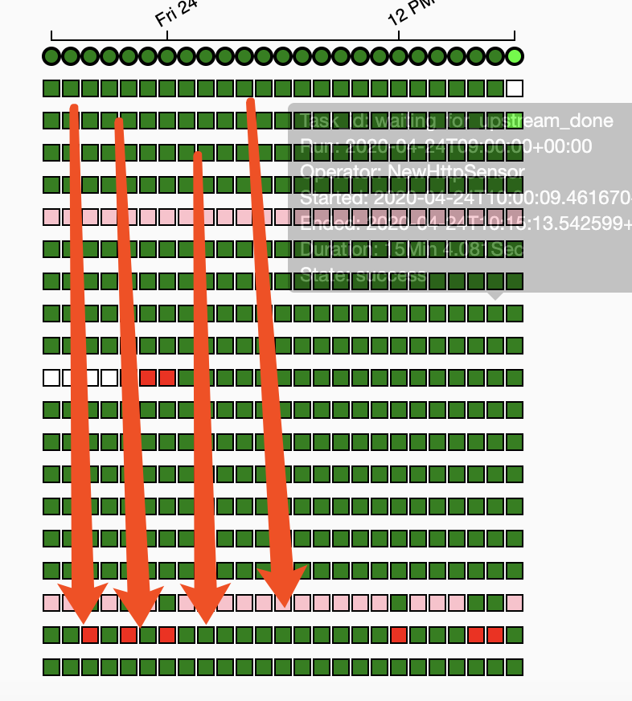

# Airflow 搭建Data Pipeline 实战总结

Airflow 作为一款开源分布式任务调度框架，已经在业内广泛的应用。笔者这里借此机会总结一下，Freewheel Transformer团队在近两年的使用Airflow作为调度器，编排各种批处理场景下的ETL Data Pipelines的经验。本文主要围绕Airflow相关的经验，想要了解更多Spark和EMR 相关文章，请参阅团队其他文章
* [Apache Spark 3.0 新特性在 FreeWheel 核心业务数据团队的应用与实战](https://www.infoq.cn/article/ILfkik8fN5ajQwGqJzoZ)
* [“榨干”EMR开销！AWS EMR在搭建大数据平台ETL的应用实践](https://www.infoq.cn/article/LAY1Uag3LGLq9OCDFc6W)

## 应用场景简介
在公司批数据处理的使用场景中，主要分成两种，一种是固定时间调度的 **ETL pipelines** , 比如hourly, daily, weekly等pipelines，用于日常数据建仓; 另一种是没有固定调度时间的 **修数据pipelines** 。 

**ETL pipelines**   
基于业务的不同使用场景，有很多流程不同的ETL pipelines。这些pipelines可以设置不同的schedule mode: hourly，daily，weekly 等. 各种pipelines 协同工作可以完成满足数据业务方对不同粒度的数据建仓需求。

**修数据 pipelines**  
无论是系统服务还是数据服务, Design For Failure 是一个重要的原则，是我们实践过程中必须考虑的。遇到错误的配置，代码缺陷等问题，可能也会导致已经发布的数据需要重新计算和发布。这种情况往往需要处理的batch会很多，这时如果在原来的ETL上操作的话，会影响日常pipelines的运行和资源分配，因此修数据pipeline需要设计成独立运行的，专门用于处理这种情况。

## 为什么选择Airflow？
针对以上的应用场景，在pipeline scheduler 选型之初，我们调研了几种主流的scheduler， 包括Airflow，[Luigi](https://luigi.readthedocs.io/en/stable/#) , [AWS Step Function](https://docs.aws.amazon.com/step-functions/latest/dg/getting-started.html), [oozie](https://oozie.apache.org/), [Azkaban](https://azkaban.github.io/azkaban/docs/latest/)。 主要从易用性，扩展性，以及社区评价和活跃程度进行了综合调研评估和体验。得益于Airflow 自带UI以及各种便利UI的操作，比如查看log，重跑历史task，查看task 代码等，并且易于实现分布式任务分发的扩展，最后我们选择了Airflow。

## Airflow 架构
这个章节我们介绍一下Airflow基础，帮助大家做一个简单的知识了解或者回顾。下图是Airflow 官网的架构图：

* Airflow.cfg:
这个是Airflow的配置文件，定义所有其他模块需要的配置。例如：meta database， scheduler& webserver 配置等
* Metadata Database:
Airflow 使用SQL Database 存储meta 信息。比如 dag ， dag run， task， task instance等信息。
* Scheduler:
Airflow Scheduler是一个独立的进程， 通过读取meta database 的信息来进行task 调度，根据dags定义生成的任务，提交到消息中间队列中（redis等）。
* Webserver:
Airflow Webserver 也是一个独立的进程， 提供web端服务， 定时生成子进程扫描对应的dag 信息，以UI的方式展示dag 或者task 的信息。
* Worker:
Airflow Worker 是独立的进程，分布在相同/不同的机器上，是task的执行节点，通过监听消息中间件（redis）领取并且执行任务。

更多详细信息请参阅
[AirFlow 官方文档](https://airflow.apache.org/docs/apache-airflow/stable/concepts.html)

## Airflow 实践总结
Data Pipelines(同 Airflow DAG)是包括一系列数据处理逻辑的task 组合。Data Pipeline 不仅要实现Extract-Transform-Load（ETL）数据， 而且要做到自动扩/缩容，完善的报警和容错机制。我们对pipelines 的要求：
* **稳定高效** : 稳定高效是对生产环境pipeline 最基本的要求。 稳定主要是指保证数据的正确性。 高效主要是指能够保证数据处理的时效性。
* **易于扩展** : 我们的业务特点是处理小时级别的batch数据。每个小时的数据量大小从几十G 到几百G不等，所以pipeline可以根据数据量大小可以自动的扩/缩容量，方便地实现分配资源调节的目标。
* **易于维护** : 搭建在AWS EMR 上的数据pipeline，为了最大程度减少AWS Cost，我们选择使用Spot Instances。 需要折中考虑pipeline 人工干预或者维护的成本，所以需要及时报警，自动恢复以及容错的能力。

### 最佳实践和原则
先介绍一下我们的使用场景，所有的pipeline 搭建在AWS EMR环境中。结合业务的应用场景，pipeline 主要功能包括 **等待上游数据ready** ， 根据上游数据大小 **动态计算分配AWS资源** ， **Transform&Aggregate** 上游batch数据，**Publish batch 数据** 和 **回收AWS资源** 。为了满足需求，最初的ETL Pipeline 设计如下图：

* 最大化实现代码复用
  * 遵循DRY 原则：指不写重复的代码，把能抽象的代码抽象出来，尽管pipeline(DAG)的实现都是基于流程的, 但在代码组织上还是可以利用面向对象对各个组件的代码进行抽象，减少冗余代码。
  * 由于业务需要，我们有各种各样的pipelines。我们分析抽象了不同pipeline的各个模块的异同，提取相同部分，对不同的部分进行了不同实现。 具体来说，不同pipeline 虽然特性完全不一样，但是相同点是都是数据的Extract & Transform & Load操作，并记录track 信息， 并且都是运行在AWS EMR 上的SPARK jobs。在实践中，发现很多模块的task 有可复用的流程。由于Airflow DAG 是面向过程的执行，并且task 没办法继承或者使用return传递变量，但是代码组织结构上还是可以面向对象结构组织的，达到最大化代码复用的目的。
  * 比如Task A 和Task B 是对不同的数据源进行transform 操作， workflow 可以抽象为准备工作，执行工作，tracker及teardown。如果Task A和Task B 的执行工作不一样， 只需要在子类中分别实现两种task的执行过程， 而其他准备工作，tracker， teardown是可以在基类中实现，所以代码依然是面向对象的实现方式。

* 保证pipeline &task 幂等性可重试

  由于业务特性和AWS spot instances 被回收的问题，经常会有task 需要rerun的情况，基于这样的前提，我们要保task和pipeline 都是要幂等可重试，如果pipeline上的任意task失败都可以自动或手动进行重试，不需任何额外的步骤，则整条pipeline也是幂等可重试。
  * DAG 幂等  
  如何定义每个pipeline需要处理的batch_id?  保证pipeline幂等可重试呢？  
  **方案1** : 判断上游处理latest_batch_id是否等于已经处理过的最新batch_id, 如果新于处理过的batch，则这个latest batch为pipeline 本次运行需要处理的batch_id， 否则继续等待上游更新下个latest_batch_id。  
  **方案2** : pipeline schedule mode是hourly情况下，AirFlow 计算出的DAG.execution_date， 进而演算出batch_id。  
  **结论** : 我们选择方案2。 方案1的问题在于每次处理的时候batch id 需要依赖历史上处理过的最新batch。如果rerun 处理过的batch 则会得到和pipeline运行时不一样的结果。而采用方案2 好处是每次pipeline 执行的batch都是固定的。不依赖任何其他状态文件或者状态变量，保证无论何时rerun pipeline的某次执行（dag-run）都是处理一样的batch。
  * Task 幂等  
  Task 也不会保存任何状态，也不依赖任何外部的状态。 这样反复re-run task 也会是得到一样的结果。因此track database只是存储状态信息，并不会被task 使用或依赖。  例如publish task，非首次跑的时候需要先清理之前publish过的数据，通过Airflow 提供的接口 context["task_instance"].try_number来判断是否是首次执行task， 在task 中实现这样的判断逻辑，就可以实现是否需要清理之前publish过的数据的逻辑，进而保证task 本身是幂等的。

* 保证pipeline 鲁棒性
  * 上述pipeline 完成了基本的功能，为了增加鲁棒性，我们增加了下面的功能  
  * 增加了上游batch 空数据判断逻辑，skip掉所有下游的task，节约使用的AWS资源。我们使用了branchOperator，增加了skipEmpty（DummyOperator） task来处理整个batch 空数据的情况。节省几个task 执行的时间。注意一点，publish是必须要走的，因为需要更新api。这因为发布空数据和没发布还是有区别的。  
  * 根据各个task的本身特性，增设了dag&task 级别不同的retries，实现了dag&task 级别的自动retry/recover。
    

* 灵活使用各种callback & SLA & Timeout

  为了保证满足数据的质量和时效性，我们需要及时地发现pipeline(dag)运行中的任何错误，为此使用了Airflow Callback，SLA， Timeout的功能。
  * on_failure_callback&on_retry_callback&on_success_callback	&reties：在dag 和task 级别都可以设置参数， 这样的设置可以实现task的自动的retry 和task成功/失败/重试的自动通知， 可以及时发现问题并且自动重试。
  * SLA & Timeout：SLA是相对dag_run execution date的。timeout是相对task instance的start time。 合理利用这两个参数，可以保证实现pipeline 及时性的监控。需要注意的是Airflow 1.10.4 在是用SLA 对schedule=None 的dag 是有问题的, 详情[AIRFLOW-4297](https://issues.apache.org/jira/browse/AIRFLOW-4297)。

* 保证pipeline并发时的正确执行顺序

  没有多个batches 并发跑的时候，pipeline 执行顺序是没有问题。但是如果多个batches 并发执行，有没有可以改善的空间呢？
    * 两个batch 同时执行时，因为需要共享EMR 资源。 每个batch要都先申请AWS 资源，执行任务后回收资源，两个batch可以通过优化执行顺序来节约AWS费用。比如两个batch 都执行之后一起回收资源，而不是各自申请自己的资源然后分别回收。
    * 公司业务方对batches 之间的执行顺序是有要求的，即需要保证batch 按照时间顺序来对下游发布。  
    * Airflow默认情况配置中，pipeline上weight_rule设置是downstream，也就是说一个task下游的task个数越多。priority_weight越大，那么优先级越高。所以执行效果如下图：也就是说会优先执行上游task，也就不能保证早batch优先执行. （下图中，一列代表一次pipeline的执行过程，即dag run）  
   
         
    * 如果改成upstream， 也就是说一个task的上游越多，它的priority_weight 越大，优先级越高。执行效果如下，也就是会有会执行把早batch执行完，晚batch 稍后执行。  
    
    
  * 基于业务方的需求，pipeline希望执行顺序是upstream mode， 这样可以尽早发布早batch。但是会造成AWS EMR 资源必须先回收后申请造成的时间和费用的浪费。所以这个问题不能够通过简单的Airflow 配置来改变。所以，需要修改一下申请资源task和回收资源task来传递一些信息。 比如在回收资源的时候的时候发现有batch等待申请资源那么就不执行回收。 如此结合的方式，可以实现:早batch，早发布，有batch 等待的时候不用回收资源，来节约cost的同时保证发布顺序。更多关于EMR 使用的细节，详见[“榨干”EMR开销！AWS EMR在搭建大数据平台ETL的应用实践](https://www.infoq.cn/article/LAY1Uag3LGLq9OCDFc6W)

* 安全与权限管理：  
Airflow是一个公用组件，各个团队都可以部署自己的pipeline 到公共的Airflow。这种情况下，权限管理就尤为必要了。我们采用了LDAP + Muti-Tenant的方式来管理团队在Airflow的权限。
  * **需要实现的功能** :  
  Admin & RW & RO 账户， 可以将读写权限分离  
  定义Pipeline Owner Group，pipeline 只对Owner Group内人员可见，Owner group 信息可能随时更新人员信息   
  多个Pipeline 可以拥有变动Oncall Group并授权只读权限， Oncall Group 也会随时更改
  
  * **方案** :   
  使用Airflow RBAC 管理权限，提供Admin User, Op, Viewer和Public 权限分离；     
  利用LDAP Group 划分pipeline owner group, pipeline 对LDAP group 人员增删改透明， 不需要额外的操作维护group和人的对应关系。    
  定义variable 存储On-Call 名单，可以通过Airflow UI 随时修改。 
  
  针对这个方案，我们重新实现了AirflowSecurityManager, 将上面三种逻辑进行了封装。

* 修数据pipeline的解决方案  
经过了反复几轮迭代演进，ETL pipeline 最终稳定的运行了。但是我们的需求又来了：就是如果需要历史数据重新处理？这样的pipeline 还能否胜任呢？
  * 由于ETL pipeline 的task都是原子性的，也就是说任何时间去rerun task 都是能拿到相同的结果的。所以当重新处理，是可以直接clean 已经跑过的对应batch的dag run的。
  * 上述解决办法在只需要重新处理历史上少数个batch的话，是没有什么问题的。但是如果处理成百上千的batches呢？是不是就会影响正常的pipeline执行了呢？

  针对以上的问题，我们需要扩展ETL pipeline。也就是说需要一个DAG能够处理多个batches的情况，并且与原有的ETL pipeline 相互隔离。虽然修数据pipeline 是一个dag 处理多个batches，然后每个batch执行的过程和ETL pipeline 都是一样的。 仅仅有以下区别：
    * 修数据pipeline需要处理的batches需要外部传入。
    * 修数据pipeline需要可以支持多集群并发的处理，加快数据发布速度。
    为了解决以上两个问题，我们开发了DAG Generator 工具，同时把ETL pipeline 抽象成了模板， 通过这个DAG Generator 指定处理的batch的范围就可以生成修数据pipeline，并且动态计算分配queue 和pool 实现多集群的并发处理。

## 遇到的问题
* 分布式与代码同步问题  
Airflow 是分布式任务分发的系统， master 和worker 会部署在不同的机器上，并且worker 可以有很多的类型和节点。 当master 与worker code 不一致时，会引入一些奇怪的问题，所以需要解决分布式系统中代码升级与同步的问题。 这种情况为了解决code 一致性的问题。 我们引入了efs 作为代码存储。所有的worker&master 都mount 到相同efs，经过我们的实践，code同步和部署的问题迎刃而解。

* Customized Operator  
Airflow 原生的Operator 是十分丰富的，我们可以根据自己的使用场景去丰富实现需要的Operator。如下图：

  比如，我们的应用场景中，有一种场景是需要轮询上游API，如果上游api同时发布多个batch的数据，我们只需要执行最新的一个batch， 这种行为类似将Sensor和短路行为结合在一起，没有现有的Operator 可以使用。所以我们实现了定制化的Operator，实现了业务场景的需求。

* scheduler hang  
我们使用的airflow版本是1.10.4，scheduler并不支持HA。在实际使用中，airflow scheduler 和meta database是单点。为了增加系统的健壮性，曾经尝试过给database 加上load balancer。然而遇到hang的问题，经过反复的debug， 我们遇到的hang是来自于sql pool(sqlAlchmy)维护的connection pool和database load balancer的冲突。基于这种分析，通过直连Database解决了scheduler hang的问题。

## 实践成果
* 经过几轮的迭代改进，目前airflow 集群可以支持多条ETL pipeline，可以自动适应处理300多G的数据量，最大化利用Airflow 特性自动retry，配合合理的报警通知，目前在较少人力成本下，已经稳定运行超过2年的时间，并没有发生故障。
* 自动化的修数据pipeline，可以有力支持多种修数据的方案。
* 搭建了自动生成dag code 的工具，可以实现方便快捷创建多条相似pipeline。
* 在安全认证和权限管理的保障下，airflow平台被多个团队使用，合理利用了AWS资源。
* 值得一提的是，2020年Spark3.0版本发布，经过组内调研分析和性能测试，Spark3.0 AQE的特性给我们pipeline 带来了高达40%的性能提升。更多信息请参考 [Apache Spark 3.0 新特性在 FreeWheel 核心业务数据团队的应用与实战](https://www.infoq.cn/article/ILfkik8fN5ajQwGqJzoZ)

## 未来展望
接下来我们会根据项目的安排，调研Airflow2.0 特性，继续丰富完善各种pipeline ，期待能够搭建更稳定，更智能的pipelines。

